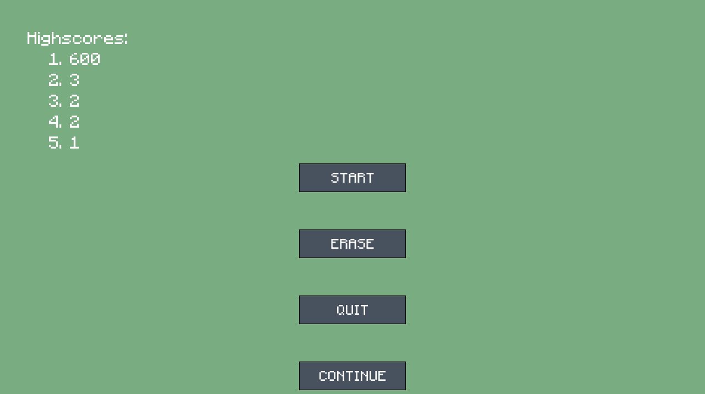
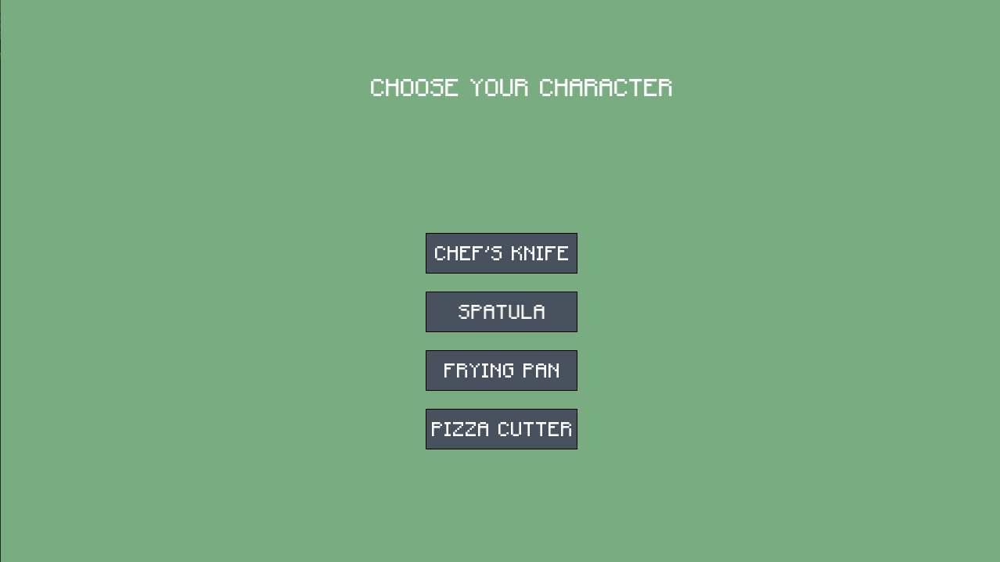
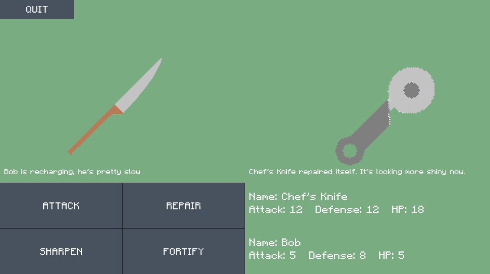

# Kitchenbrawl

This is my game that i made for school about Kitchen utensils

## Main menu

On the main menu, we obviously have a start game button, but also an erase button which erases your game data (highscore and savefile)
There is also a continue button to continue your fight if you happen to press quit in the game

## Character selection
After you press start, you'll be send to a character selection screen, where you can play 4 utensils
when choosing a character, an enemy is created to match the strength of the player.

## The fightscreen
Inside of the fightscreen, you have 4 options; attack, repair, sharpen and fortify. Sharpen increases attack, fortify increases defense and repair gives the user some health back
The main aim of the game is to defeat as many enemies as you can before you die to 1 enemy. Everytime an enemy is defeated, the next enemy will be stronger. 

